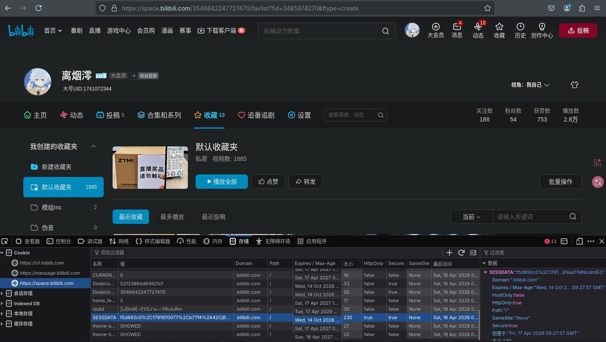

# Chinese (CHINESE) | [English (ENGLISH)](#) | [More Languages (更多语言)](#)

# Disclaimer
**I'm just a junior high school student from China (PRC), so I'm not very good at English. To introduce the project better, I might use machine translation or AI.**

# Introduction
**This tool helps you easily download videos from Bilibili on platforms such as `Windows` (Windows system on my computer is broken, so no package is provided — kind users are welcome to help package the .exe), `Linux`, and `Android` (Termux, ZeroTermux, etc.). This tool is mainly designed for downloading favorites (whether `public` or `private`), since I couldn't find any tool that met my needs, so I made one full of bugs.**

# Description
**This is a project that can download audio or video files from the website `bilibili.com` in China (PRC). Because I need to download some files that only my account can access from the website, I made this tool. I plan to create `Windows`, `Linux`, and `Android` versions over 4 years.**

# Disclaimer (Avoiding Pitfalls)
**Because my GUI/WEB development skills are terrible, both the GUI and WEB versions heavily rely on AI (DeepSeek, DouBao, FittenCode). If bugs occur, they will not be fixed promptly. Please first try to fix them using AI (fighting fire with fire? emmm…). If that fails, please use the `CLI version`. Contributions from all developers are welcome.**

# Download & Usage
| Platform | Windows | Linux Debian-based | Android (Termux) |
| --- | --- | --- | --- |
| Download | [Windows system broken, QWQ](#) | [Click to Download](https://github.com/BuelieR/bili-download/releases/download/R_v1.0.0/bili-downloader_1.0.0_all_linux.deb) | [Click to Download](https://github.com/BuelieR/bili-download/releases/download/R_v1.0.0/bili-downloader_1.0.0_all_linux.deb) |
| Mirror | [Windows system broken, QWQ](#) | [Click to Download](#) | [Click to Download](#) |
| Web Version | [Windows system broken, QWQ](#) | [Click to Download](https://github.com/BuelieR/bili-download/releases/download/R_v1.0.0/bili-downloader-web_1.0.0_all_linux.deb) | [Click to Download](https://github.com/BuelieR/bili-download/releases/download/R_v1.0.0/bili-downloader-web_1.0.0_all_linux.deb) |

# Compilation
- **First install `FFmpeg` & `pyinstaller` — these are dependencies of this project.**
- **Run `pip install -r requirements.txt` to install dependencies for the `CLI` version.**
  - `pip install -r requirements-gui.txt` to install the `GUI` version (now deprecated).
  - `pip install -r requirements-web.txt` to install the `WEB` (Flask-based) version (more bugs).
- **Run `python3 <path to main.py/web_app.py/_Deprecated_gui_main.py>` to test (recommended in a virtual environment).**
- **Run `package.sh` to package the `CLI` version for Linux Debian-based systems.**
  - Run `package_web.sh` to package the `WEB` (Flask) version for Linux Debian-based systems.
  - To package the GUI version, please modify the `MAIN_FILE` constant in `package.sh` to `_Deprecated_gui_main.py`.

# Frequently Asked Questions (FAQ)
- **What is `SESSDATA`?**
  - Bilibili login credential. How to obtain: On Bilibili, press `F12` to open Developer Tools -> Open the `Storage` tab -> Open `Cookie` > `https://space.bilibili.com`. You can find the `SESSDATA` key in the item filter. Its value is what this project requires.
  - 
- **What are the dependencies of this project's executable?**
  - `FFmpeg`
  - `Windows`/`Linux`/`Android (Termux)`

# Contribution Guidelines
- **Please create your own `.gitignore` file and include the following as a reference:**
```
.gitignore
venv/
pycache/
*.deb
*.rpm
*.bin
*.sh
!package.sh
*.json
package/
bili-downloader-web-1.0.0/
build/
dist/
dists/
*.spec
*.tar.gz
!package_web.sh
```
